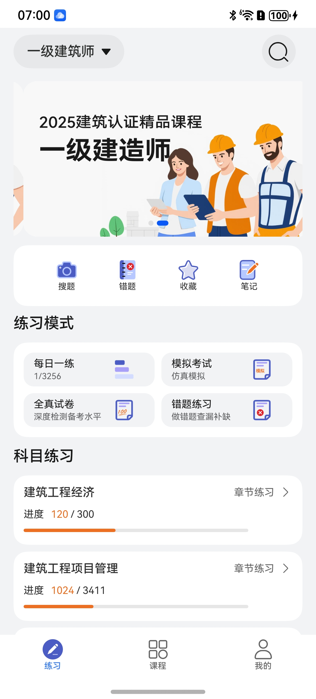
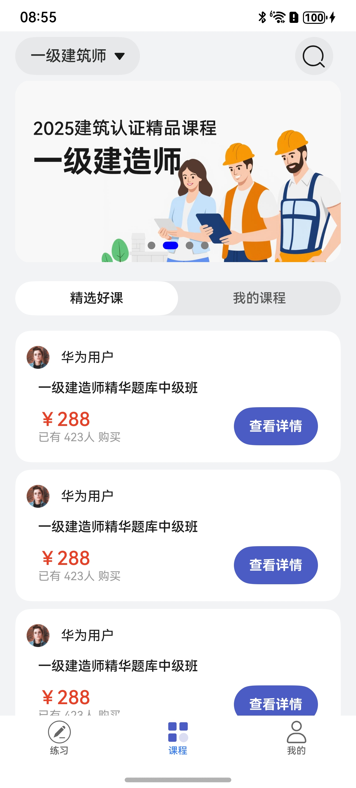
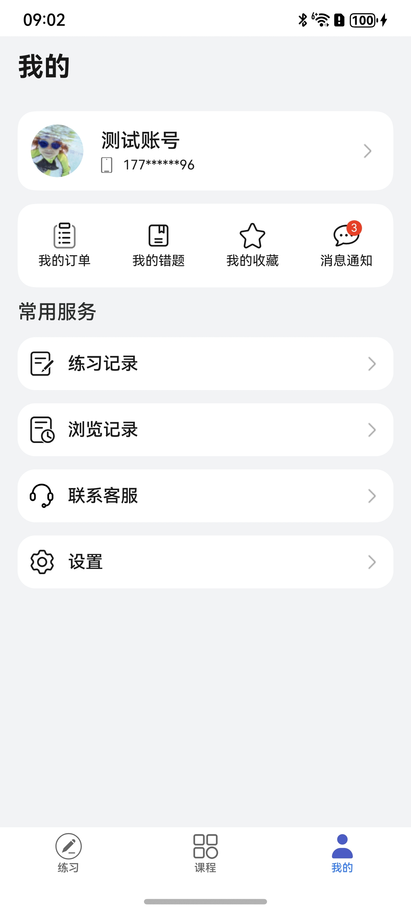

# 教育（备考）应用模板快速入门

## 目录

- [功能介绍](#功能介绍)
- [组件](#组件)
- [环境要求](#环境要求)
- [快速入门](#快速入门)
- [权限要求](#权限要求)
- [开源许可协议](#开源许可协议)

## 功能介绍


本模板为备考类应用提供了常用功能的开发样例，模板主要分练习、课程和我的三大模块：

- 练习：展示类别分栏选项、搜索课程、练习模式、刷题进度
- 课程：按类别展示精选课程与已购课程
- 我的：账号相关信息，展示订单、错题、收藏、浏览记录，以及设置等功能。

本模板已集成华为账号服务，只需做少量配置和定制即可快速实现华为账号的登录等功能。

| 练习                                                   | 课程                                                   | 我的                                                   |
|------------------------------------------------------|------------------------------------------------------|------------------------------------------------------|
|  |  |  |

本模板主要页面及核心功能清单如下所示：

```ts
题库模板
 |-- 开屏页
 |-- 练习
 |    |-- banner
 |    |-- 搜索
 |    └-- 答题练习
 |-- 课程
 |    |-- 分类列表
 |    |-- 精选课程
 |    |    |-- 课程详情
 |    |    └-- 支付购买
 |    └-- 已购我的课程
 |         |-- 练习模式
 |         |-- 考试模式
 |         |-- 错题记录
 |         └-- 收藏记录
 |         └-- 笔记记录
 └-- 我的
      |-- 用户信息
      |    |-- 登录
      |    |-- 用户信息
      |-- 我的订单
      |-- 我的错题
      |-- 我的收藏
      |-- 练习记录
      |-- 浏览记录
      └-- 设置
           |-- 个人信息
           |-- 意见反馈
           |-- 反馈记录
           |-- 隐私协议
           |-- 清除缓存
           └-- 退出登录
    
           
```

本模板工程代码结构如下所示：

```
Exam
  ├─commons/commonLib/src/main
  │  ├─ets
  │  │  ├─components
  │  │  │      CommonHeader.ets                 // 一级页面标题组件
  │  │  │      TopBar.ets                       // 标题菜单内容组件
  │  │  ├─utils
  │  │  │      Logger.ets                       // 日志
  │  │  │      PreferenceUtil.ets               // 首选项
  │  │  ├─viewModel
  │  │  │      BrowsingHistoryModel.ets         // 记录模块数据模型
  │  │  │      OrderInfo.ets                    // 订单数据模型
  │  │  │      PracticeRecordModel.ets          // 练习数据模型
  │  └─resources
  ├─commons/router_module/src/main
  │  ├─ets
  │  │  ├─routerModule
  │  │  │  │    RouterModule.ets                // 路由
  │  │  │  │  ├─constants
  │  │  │  │  │  │ RouterMap.ets                // 路由Key
  │  └─resources  
  │─components/aggregated_payment/src/main   
  │  ├─ets
  │  │  ├─common
  │  │  │      Constant.ets                     // 常量类
  │  │  ├─components
  │  │  │      AggregatedPaymentPicker.ets      // 支付组件
  │  │  ├─model
  │  │  │      Index.ets                        // 数据类型
  │  │  │      WXApiWrap.ets                    // 微信支付数据类型
  │  │  └─viewmodel
  │  │         AggregatedPaymentVM.ets          // 支付组件数据模型
  │  └─resources
  │─components/answer_questions/src/main   
  │  ├─ets
  │  │  ├─components
  │  │  │      AnswerQuestionsPage.ets           // 答题组件
  │  │  │      AddNotePage.ets                   // 添加笔记组件
  │  │  │      AnswerSheetPage.ets               // 答题卡组件
  │  │  ├─dialog
  │  │  │      AddNoteDialog.ets                 // 添加笔记弹框
  │  │  │      AnswerSheetDialog.ets             // 答题卡弹框
  │  │  └─viewModel
  │  │         TopicItemModel.ets                // 答题选项模型
  │  │         TopicPageModel.ets                // 答题模型
  │  └─resources
  │─components/feed_back/src/main   
  │  ├─ets
  │  │  ├─components
  │  │  │      Feedback.ets                      // 意见反馈功能组件
  │  │  ├─model
  │  │  │      FeedbackRecordModel.ets           // 数据类型
  │  │  ├─utils
  │  │  │      FileSelect.ets                    // 意见反馈功工具类
  │  └─resources
  │─components/select_category/src/main   
  │  ├─ets
  │  │  ├─components
  │  │  │      MainPage.ets                      // 二级分类组件
  │  │  │      ThirdcatePage.ets                 // 三级分类组件
  │  │  ├─model
  │  │  │      SelectCateModel.ets               // 数据类型     
  │  └─resources
  │─components/login_info/src/main   
  │  ├─ets
  │  │  ├─components
  │  │  │      AgreementDialog.ets               // 同意协议弹窗组件
  │  │  │      QuickLogin.ets                    // 一键登录组件
  │  │  ├─model
  │  │  │      ErrorCode.ets                     // 错误码类型
  │  │  │      UserInfo.ets                      // 用户类型
  │  │  └─utils
  │  │         AccountUtil.ets                   // 账户工具类
  │  └─resources
  │─components/search/src/main   
  │  ├─ets
  │  │  ├─components
  │  │  │      SearchPage.ets                    // 搜索组件
  │  └─resources
  │─components/search_question/src/main   
  │  ├─ets
  │  │  ├─components
  │  │  │      SearchQuestionPage.ets            // 一键搜题组件
  │  └─resources
  │─components/base_select/src/main   
  │  ├─ets
  │  │  ├─components
  │  │  │      MainPage.ets                      // 基础通用组件
  │  │  ├─model
  │  │  │      SelectModel.ets                   // 选项数据模型
  │  └─resources  
  │─features/homePage/src/main   
  │  ├─ets
  │  │  ├─components                             // 封装组件
  │  │  │      CourseBookComponent.ets           // 资料卡片组件        
  │  │  │      CourseComponent.ets               // 课程卡片      
  │  │  ├─model
  │  │  │     ChapterPractice.ets                // 分类页面数据模型
  │  │  │     CommonTopic.ets                    // 分类数据模型
  │  │  │     Course.ets                         // 课程数据模型  
  │  │  │     CourseArray.ets                    // 课程数组模型
  │  │  │     CourseBook.ets                     // 资料模型
  │  │  │     CourseQuestions.ets                // 科目数据模型
  │  │  │     PracticeMode.ets                   // 业务类型数据模型  
  │  │  │     TopicItemModel.ets                 // 答题类型数据模型  
  │  │  │     TopicModel.ets                     // 分类数据源  
  │  │  ├─pages
  │  │  │      ChapterPractice.ets               // 科目页面
  │  │  │      FeaturedCourses.ets               // 精选课程页面
  │  │  │      MainPage.ets                      // 练习首页面
  │  │  │      MaterialDownload.ets              // 资料页面
  │  │  │      SearchIndexPage.ets               // 搜索页面
  │  │  │      SearchInputPage.ets               // 搜索输入框页面  
  │  │  │      SecondListPage.ets                // 2级分类
  │  │  │      ThirdListPage.ets                 // 3级分类
  │  │  │      TopicHomePage.ets                 // 1级分类  
  │  │
  │  └─resources
  │─features/topicPage/src/main   
  │  ├─ets
  │  │  ├─views
  │  │  │      AnswerQuestionsPage.ets           // 答题模式一页面
  │  │  │      AnswerQuestionsTwoPage.ets        // 答题模式二页面
  │  │  │      CourseHomePage.ets                // 课程页面
  │  │  │      CourseIntroductionPage.ets        // 课程详情页面
  │  │  │      ExamResultPage.ets                // 答题结果页面
  │  │  │      GoodCourseDetailPage.ets          // 精选课程页面
  │  │  │      MockTestPage.ets                  // 科目练习页面
  │  │  │      MyCollectionPage.ets              // 收藏页面
  │  │  │      MyNotesPage.ets                   // 笔记页面
  │  │  │      MyWrongPage.ets                   // 错题页面
  │  │  │      TestReportPage.ets                // 测试报告页面
  │  │  │      ViewNotePage.ets                  // 笔记组件
  │  │  └─viewModel
  │  │  │      CourseHomeModel.ets               // 课程页面数据模型
  │  │  │      PracticeMode.ets                  // 科目数据模型
  │  │  │      SecondListModel.ets               // 选项类型数据模型
  │─features/minePage/src/main   
  │  ├─ets
  │  │  ├─components
  │  │  │      Header.ets                        // Header组件
  │  │  ├─viewModel                              // 数据类型
  │  │  │      MessageModel.ets             
  │  │  │      setUpModel.ets                    // 设置相关模型数据模型
  │  │  │      MineModel.ets                     // 用户资料信息数据模型
  │  │  ├─views
  │  │  │      AboutPage.ets                     // 关于页面
  │  │  │      AuthenticationPage.ets            // 用户认证协议页面
  │  │  │      BrowsingHistoryPage.ets           // 浏览页面
  │  │  │      CollectionPage.ets                // 课程收藏页面
  │  │  │      CoursePage.ets                    // 课程精选页面
  │  │  │      EditPersonalCenterPage.ets        // 个人信息详情页面
  │  │  │      FeedbackPage.ets                  // 意见反馈页面
  │  │  │      FeedbackRecordPage.ets            // 反馈记录页面
  │  │  │      MessageCenterPage.ets             // 消息页面
  │  │  │      MinePage.ets                      // 我的页面
  │  │  │      MyOrderPage.ets                   // 订单首页页面
  │  │  │      OneDayPracticeRecordsPage.ets     // 单个练习记录页面
  │  │  │      OrderDetailPage.ets               // 订单详情页面
  │  │  │      OrderListPage.ets                 // 订单页面
  │  │  │      PracticeDetailsPage.ets           // 反馈页面
  │  │  │      PracticeRecordsPage.ets           // 练习记录页面
  │  │  │      PrivacyAgreementPage.ets          // 同意
  │  │  │      PrivacyPage.ets                   // 协议
  │  │  │      PrivacyStatementPage.ets          // 隐私页面
  │  │  │      SetupPage.ets                     // 设置页面
  │  │  │      TermsOfServicePage.ets            // 用户服务页面
  └─products/entry/src/main   
     ├─ets
     │  ├─entryability
     │  │      EntryAbility.ets                  // 应用程序入口
     │  ├─entrybackupability
     │  │      EntryBackupAbility.ets            // Backup配置入口     
     │  ├─pages
     │  │      Index.ets                         // 入口页面
     │  │      LoginPage.ets                     // login页面
     │  ├─model
     │  │      TabListItem.ets                   // 数据声明
     │  ├─viewmodels
     │  │      MainVM.ets                        // 页面数据模型
     │  ├─common                                 // 常量及Tab数据源
     │         TabConstants.ets
     └─resources
```
## 组件

本模板中提供了多种组件，您可以按需选择合适的组件进行使用，所有组件存放在工程根目录的components下。

| 组件                         | 描述                | 使用指导                                             |
|----------------------------|-------------------|--------------------------------------------------|
| 登录组件（login_info）       | 支持华为一键登录          | [使用指导](components/login_info/README.md)    |
| 支付组件（aggregated_payment）   | 支持华为支付，微信支付，支付宝支付 | [使用指导](components/aggregated_payment/README.md)  |
| 答题组件（answer_questions）       | 展示题库样式            | [使用指导](components/answer_questions/README.md)             |
| 分栏基础组件（base_select）        | 左右分栏选项            | [使用指导](components/base_select/README.md) |
| 多级分栏组件（select_category）    | 多级别选项样式           | [使用指导](components/select_category/README.md)    |
| 搜索组件（search）               | 本组件提供了搜索的相关功能     | [使用指导](components/search/README.md)         |
| 一键搜题组件（search_question） | 多功能搜题组件           | [使用指导](components/search_question/README.md)       |
| 意见反馈组件（feed_back）          | 意见反馈组件            | [使用指导](components/feed_back/README.md)       |

## 环境要求

### 软件

* DevEco Studio版本：DevEco Studio 5.0.0 Release及以上
* HarmonyOS SDK版本：HarmonyOS 5.0.0 Release SDK及以上

### 硬件

* 设备类型：华为手机（直板机）
* HarmonyOS版本：HarmonyOS 5.0.0 Release及以上

### 调试
本模板不支持使用模拟器调试，请使用真机进行调试。

## 快速入门

### 配置工程

在运行此模板前，需要完成以下配置：

1. 在AppGallery Connect创建应用，将包名配置到模板中。

   a. 参考[创建HarmonyOS应用](https://developer.huawei.com/consumer/cn/doc/app/agc-help-createharmonyapp-0000001945392297)为应用创建APP ID，并将APP ID与应用进行关联。

   b. 返回应用列表页面，查看应用的包名。

   c. 将模板工程根目录下AppScope/app.json5文件中的bundleName替换为创建应用的包名。

2. 配置华为账号服务。

   a. 将应用的client ID配置到product/entry/src/main路径下的module.json5文件中，详细参考：[配置Client ID](https://developer.huawei.com/consumer/cn/doc/harmonyos-guides/account-client-id)。

   b. 申请华为账号一键登录所需的quickLoginMobilePhone权限，详细参考：[配置scope权限](https://developer.huawei.com/consumer/cn/doc/harmonyos-guides/account-config-permissions)。

3. 配置支付服务。

   华为支付当前仅支持商户接入，在使用服务前，需要完成商户入网、开发服务等相关配置，本模板仅提供了端侧集成的示例。详细参考：[支付服务接入准备](https://developer.huawei.com/consumer/cn/doc/harmonyos-guides/payment-preparations)。

4. 对应用进行[手工签名](https://developer.huawei.com/consumer/cn/doc/harmonyos-guides/ide-signing#section297715173233)。

5. 添加手工签名所用证书对应的公钥指纹。详细参考：[配置应用签名证书指纹](https://developer.huawei.com/consumer/cn/doc/app/agc-help-signature-info-0000001628566748#section5181019153511)

### 运行调试工程

1. 连接调试手机和PC。

2. 菜单选择“Run > Run 'entry' ”或者“Run > Debug 'entry' ”，运行或调试模板工程。


## 权限要求

- 网络权限：ohos.permission.INTERNET

## 开源许可协议

该代码经过[Apache 2.0 授权许可](http://www.apache.org/licenses/LICENSE-2.0)。
