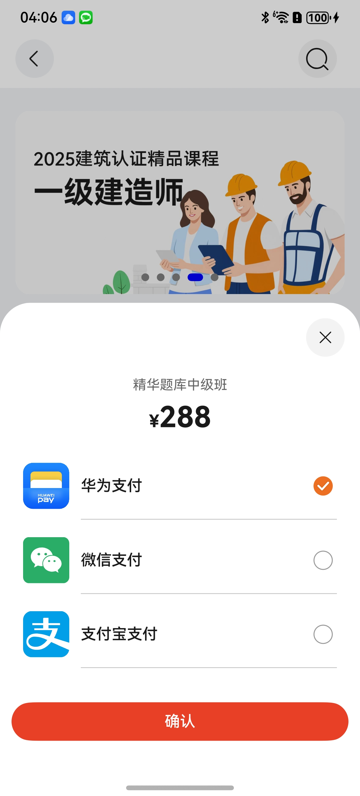

# 支付组件

## 目录

- [简介](#简介)
- [约束与限制](#约束与限制)
- [快速入门](#快速入门)
- [API参考](#API参考)
- [示例代码](#示例代码)

## 简介

本组件提供了通过华为支付、支付宝支付和微信支付方式进行订单支付的能力，开发者可以根据业务需要选择实现相关支付方式。



## 约束与限制
### 环境
* DevEco Studio版本：DevEco Studio 5.0.0 Release及以上
* HarmonyOS SDK版本：HarmonyOS 5.0.0 Release SDK及以上
* 设备类型：华为手机（直板机）
* HarmonyOS版本：HarmonyOS 5.0.0 Release及以上

### 调试
本模板不支持使用模拟器调试，请使用真机进行调试。

## 快速入门

1. 安装组件。

   如果是在DevEvo Studio使用插件集成组件，则无需安装组件，请忽略此步骤。

   如果是从生态市场下载组件，请参考以下步骤安装组件。

   a. 解压下载的组件包，将包中所有文件夹拷贝至您工程根目录的XXX目录下。

   b. 在项目根目录build-profile.json5添加aggregated_payment模块。

    ```
   // 在项目根目录build-profile.json5填写aggregated_payment路径。其中XXX为组件存放的目录名。
     "modules": [
         {
            "name": "aggregated_payment",
            "srcPath": "./XXX/aggregated_payment",
         }
      ]
   ```
   c. 在entry目录下oh-package.json5中添加依赖。
   ```
   // XXX为组件存放的目录名称
      "dependencies": {
         "aggregated_payment": "file:./XXX/aggregated_payment"
       }

    ```

2. 引入支付组件句柄。
   ```typescript
   import { AggregatedPaymentPicker, ChannelType, WxExtraInfo } from 'aggregated_payment';
   ```


3. 完成华为支付服务器侧预下单开发，配置[ChannelInfo](#ChannelInfo说明)中华为支付的preOrderInfo字段为预下单orderStr，详情参考[商户基础支付场景](https://developer.huawei.com/consumer/cn/doc/harmonyos-guides/payment-payment-process#section126982401468)。

   ```typescript
   // 预下单orderStr示例
   let orderStr = '{"app_id":"***","merc_no":"***","prepay_id":"xxx","timestamp":"1680259863114","noncestr":"1487b8a60ed9f9ecc0ba759fbec23f4f","sign":"****","auth_id":"***"}'

   ```
4. 完成微信支付相关的商户权限申请及微信权限开通，并完成App下单相关服务器开发，配置[WxExtraInfo](https://pay.weixin.qq.com/doc/v3/merchant/4013070351#%E5%AD%97%E6%AE%B5%E8%AF%B4%E6%98%8E)中的相关字段为支付参数，详情请参考[微信App支付](https://pay.weixin.qq.com/doc/v3/merchant/4013070158)。
   ```typescript
   // WxExtraInfo对象示例
    {
      partnerId: '****',
      appId: '****',
      packageValue: 'Sign=WXPay',
      prepayId: '****',
      nonceStr: '****',
      timeStamp:'****',
      sign : '****',
      extData: '****'
    }
   ```
5. 支付宝详情请参考[支付宝支付](https://ohpm.openharmony.cn/#/cn/detail/@cashier_alipay%2Fcashiersdk)。

   ```typescript
   // orderInfo 由服务端生成
   // 第二个参数 控制是否展示支付宝loading        
      new Pay().pay(orderInfo, true).then((result) => {
       let message =
       `resultStatus: ${result.get('resultStatus')} memo: ${result.get('memo')} result: ${result.get('result')}`;
      }).catch(() => {
        //在此处进行异常处理
      });
   ```

6. 调用组件，详细参数配置说明参见[API参考](#API参考)。

   ```typescript
   AggregatedPaymentPicker({
      price:'***',
      goodsName:'*****',
      channelInfo: [{
        channelType: ChannelType.HUAWEI_PAY,
        name: '华为支付',
        icon: $r('app.media.hw_pay'),  //todo 需要图片资源
        preOrderInfo:'{"app_id":"***","merc_no":"***","prepay_id":"xxx","timestamp":"1680259863114","noncestr":"1487b8a60ed9f9ecc0ba759fbec23f4f","sign":"****","auth_id":"***"}'
      }, {
        channelType: ChannelType.WECHAT_PAY,
        preOrderInfo: { partnerId: '****', appId: '****',packageValue: 'Sign=WXPay', prepayId: '****',
          nonceStr: '****', timeStamp:'****',sign : '****',extData: '****'},
        appId: '',
        icon: $r('app.media.wechat'),  //todo 需要图片资源
        name: '微信支付',
      }, {
        channelType: ChannelType.ALI_PAY,
        name: '支付宝支付',
        icon: $r('app.media.alipay'),  //todo 需要图片资源
        preOrderInfo: '服务端生成',
      }],
      paySuccessEvent: (type: ChannelType) => {
      },
      payFailEvent: (type: ChannelType) => {
      }
    })
   ```

## API参考


### 接口

AggregatedPaymentPicker(price:string,goodsName:string,[ChannelInfo](#ChannelInfo说明)[],paySuccessEvent:() => void,
payFailEvent:() => void)

支付组件。

**参数：**

| 参数名          | 类型               | 必填 | 说明     |
|:-------------|:-----------------|:---|:-------|
| channelInfo  | [ChannelInfo](#ChannelInfo说明)[]    | 是  | 支付渠道类型 |
| price        | string           | 否  | 金额     |
| goodsName         | string           | 否  | 商品名称   |
| paySuccessEvent         | () => void       | 否  | 成功回调   |
| payFailEvent         | () => void       | 否  | 失败回调   |

#### ChannelType枚举说明

| 名称         | 值 | 说明    |
|:-----------|:--|:------|
| HUAWEI_PAY | 0 | 华为支付  |
| ALI_PAY    | 1 | 支付宝支付 |
| WECHAT_PAY | 2 | 微信支付  |

#### ChannelInfo说明

| 名称           | 类型                              | 说明          |
|:-------------|:--------------------------------|:------------|
| channelType  | [ChannelType](#ChannelType枚举说明) | 支付渠道类型      |
| name         | string                          | 应用名称        |
| appId        | string                          | 应用ID        |
| icon         | Resource                          | 图标          |
| preOrderInfo | string/[WxExtraInfo](https://pay.weixin.qq.com/doc/v3/merchant/4013070351#%E5%AD%97%E6%AE%B5%E8%AF%B4%E6%98%8E)          | 商户配置信息      |

## 示例代码

本示例提供了实现支付宝支付、华为支付和微信支付的配置

```
import { AggregatedPaymentPicker, ChannelType } from 'aggregated_payment';

@Entry
@ComponentV2
export struct Index {
  @Local isShow: boolean = false
  @Builder
  paymentChannelSheet() {
    AggregatedPaymentPicker({
      price: '100',
      goodsName: '商品信息',
      channelInfo: [{
        channelType: ChannelType.HUAWEI_PAY,
        name: '华为支付',
        preOrderInfo: '{"app_id":"***","merc_no":"***","prepay_id":"xxx","timestamp":"1680259863114","noncestr":"1487b8a60ed9f9ecc0ba759fbec23f4f","sign":"****","auth_id":"***"}'
      }, {
        channelType: ChannelType.WECHAT_PAY,
        preOrderInfo: {
          partnerId: '****',
          appId: '****',
          packageValue: 'Sign=WXPay',
          prepayId: '****',
          nonceStr: '****',
          timeStamp: '****',
          sign: '****',
          extData: '****'
        },
        appId: '',
        name: '微信支付',
      }, {
        channelType: ChannelType.ALI_PAY,
        name: '支付宝支付',
        preOrderInfo: '服务端生成',
      }],
      paySuccessEvent: (type: ChannelType) => {
        this.isShow = false;
      },
      payFailEvent: (type: ChannelType) => {
        this.isShow = false;
      }
    })
  }

  build() {
    Column() {
      Button('立即支付').width('60%').onClick(async () => {
        this.isShow = true;
      }).bindSheet($$this.isShow, this.paymentChannelSheet()).bindSheet(this.isShow, this.paymentChannelSheet(),
        {
          height: '60%',
          preferType: SheetType.POPUP,
          onDisappear: () => {
            this.isShow = false
          }
        })
    }
    .justifyContent(FlexAlign.Center)
    .alignItems(HorizontalAlign.Center)
  }
}

```
