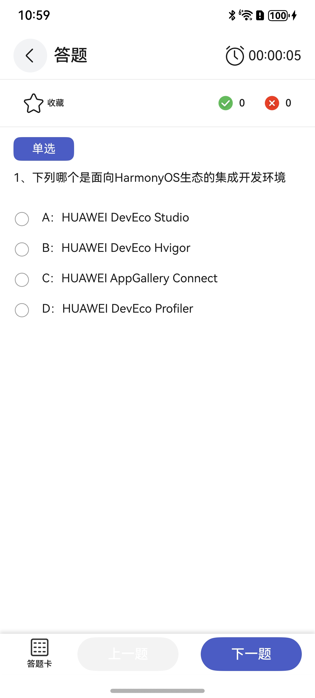
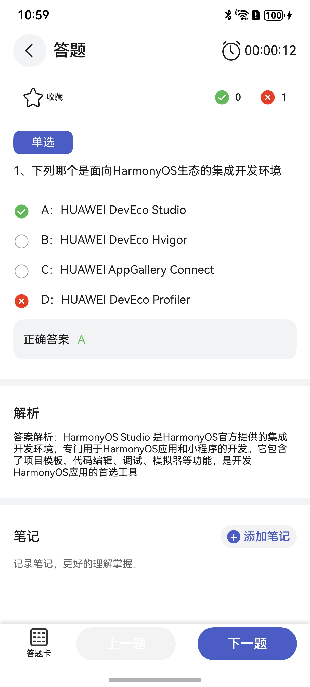
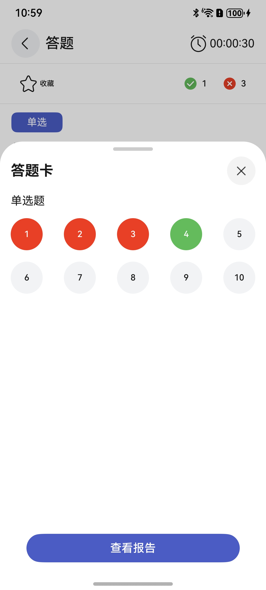
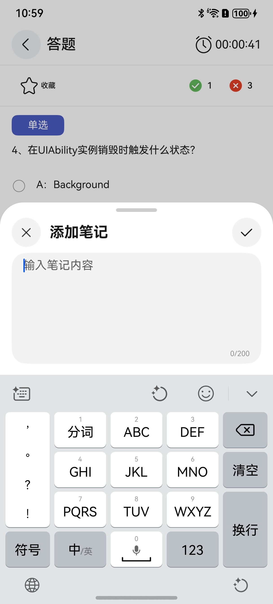

# 答题组件快速入门

## 目录

- [简介](#简介)
- [约束与限制](#约束与限制)
- [快速入门](#快速入门)
- [API参考](#API参考)
- [示例代码](#示例代码)

## 简介

本组件提供了答题、定时器、查看答题卡以及添加笔记的功能，当前答题数据均为mock数据，实际开发请填充业务真实数据。

| 未答题样式                                        | 已答题样式                                      | 答题卡                                        | 添加笔记                                         |
|----------------------------------------------|--------------------------------------------|--------------------------------------------|----------------------------------------------|
|  |  |  |  |

## 约束与限制
### 环境
* DevEco Studio版本：DevEco Studio 5.0.0 Release及以上
* HarmonyOS SDK版本：HarmonyOS 5.0.0 Release SDK及以上
* 设备类型：华为手机（直板机）
* HarmonyOS版本：HarmonyOS 5.0.0 Release及以上

## 快速入门

1. 安装组件。
   
   如果是在DevEvo Studio使用插件集成组件，则无需安装组件，请忽略此步骤。

   如果是从生态市场下载组件，请参考以下步骤安装组件。

   a. 解压下载的组件包，将包中所有文件夹拷贝至您工程根目录的XXX目录下。

   b. 在项目根目录build-profile.json5添加answer_questions模块。

   ```
   // 在项目根目录build-profile.json5填写answer_questions路径。其中XXX为组件存放的目录名。
   "modules": [
     {
       "name": "answer_questions",
       "srcPath": "./XXX/answer_questions",
     }
   ]
   ```
   c. 在entry目录下oh-package.json5中添加依赖。
   ```
   // XXX为组件存放的目录名称
   "dependencies": {
      "answer_questions": "file:./XXX/answer_questions"
   }
   ```

2. 引入组件句柄。

   ```
   import { AnswerQuestionsPage } from 'answer_questions';
   ```

3. 调用组件，详细参数配置说明参见[API参考](#API参考)。

   ```
   import { AnswerQuestionsPage } from 'answer_questions';
   
   @Entry
   @Component
   struct Index {

     build() {
       Column() {
         AnswerQuestionsPage()
       }
       .width('100%')
       .height('100%')
     }
   }
   ```

## API参考

### 接口

AnswerQuestionsPage({
   ques?: TopicItemModel[],
   practiceDuration?: number,
   currentIndex?: number,
   currentModel?: TopicItemModel,
   rightCont?: number,
   errCont?: number,
   isCollection?: boolean,
   isCloseAnswerSheet?: boolean
})

答题组件。

**参数：**

| 参数名                | 类型                                      | 是否必填 | 说明         |
|:-------------------|:----------------------------------------|:-----|:-----------|
| ques               | [TopicItemModel](#TopicItemModel对象说明)[] | 否    | 本次练习所有题目数据 |
| practiceDuration   | number                                  | 否    | 练习时长       |
| currentIndex       | number                                  | 否    | 题目下标       |
| currentModel       | [TopicItemModel](#TopicItemModel对象说明)   | 否    | 当前题目       |
| rightCont          | number                                  | 否    | 正确题数       |
| errCont            | number                                  | 否    | 错误题数       |
| isCollection       | boolean                                 | 否    | 是否收藏       |
| isCloseAnswerSheet | boolean                                 | 否    | 是否关闭答题卡    |

### TopicItemModel对象说明

| 参数名        | 类型                              | 是否必填 | 说明                  |
|------------|---------------------------------|------|---------------------|
| type       | string                          | 是    | 类型                  |
| title      | string                          | 是    | 标题                  |
| keyID      | string                          | 是    | 题目ID                |
| ques       | [AnswerItem](#AnswerItem对象说明)[] | 是    | 题目选项列表              |
| parse      | string                          | 是    | 解析                  |
| note       | string                          | 是    | 笔记                  |
| rightQues  | string[]                        | 是    | 题目答案列表              |
| selectQues | string[]                        | 是    | 选中的答案列表             |
| showState  | number                          | 是    | 答题状态: 0原始状态 1错误 2正确 |
| isAnswer   | boolean                         | 是    | 是否答题                |

### AnswerItem对象说明

| 参数名       | 类型      | 是否必填 | 说明                  |
|-----------|---------|------|---------------------|
| ansTitle  | string  | 是    | 选项标题                |
| ansID     | string  | 是    | 选项ID                |
| ans       | string  | 是    | 选项                  |
| isSelect  | boolean | 是    | 是否选中                |
| showState | number  | 是    | 答题状态: 0原始状态 1错误 2正确 |

### 事件

支持以下事件：

#### initCurrentModel

initCurrentModel(){}

答题数据初始化

#### answerEvent

answerEvent(item: AnswerItem){}

答题逻辑处理

#### onSelectIndex

onSelectIndex(index: number) {}

跳转到第index个题目

#### isCollectionEvent

isCollectionEvent: () => void = () => { }

是否收藏

#### confirmAddNote

confirmAddNote: (note: string) => void = () => {}

将添加的笔记渲染到ux页面

#### storageWrongClick

storageWrongClick: () => void = () => { }

错题记录

#### storageCollectClick

storageCollectClick: () => void = () => { }

收藏记录

#### viewReport

viewReport: () => void = () => { }

查看报告

#### onClickBack

onClickBack: () => void = () => { }

点击返回上一级

## 示例代码

   ```
   import { AnswerQuestionsPage } from 'answer_questions';
   
   @Entry
   @Component
   struct Index {

     build() {
       Column() {
         AnswerQuestionsPage()
       }
       .width('100%')
       .height('100%')
     }
   }
   ```

