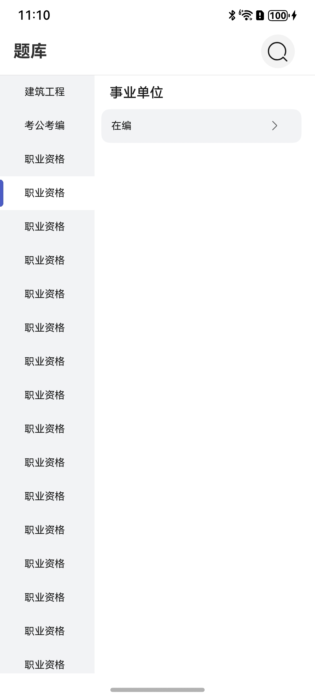

# 分栏基础组件快速入门

## 目录

- [简介](#简介)
- [约束与限制](#约束与限制)
- [快速入门](#快速入门)
- [API参考](#API参考)
- [示例代码](#示例代码)

## 简介

本组件提供了一级通用分类的能力，引入一二三级嵌套所有数据。开发者可以根据实际业务需要快速实现一级分类。




## 约束与限制
### 环境
* DevEco Studio版本：DevEco Studio 5.0.0 Release及以上
* HarmonyOS SDK版本：HarmonyOS 5.0.0 Release SDK及以上
* 设备类型：华为手机（直板机）
* HarmonyOS版本：HarmonyOS 5.0.0 Release及以上

## 快速入门

1. 安装组件。

   如果是在DevEvo Studio使用插件集成组件，则无需安装组件，请忽略此步骤。

   如果是从生态市场下载组件，请参考以下步骤安装组件。

   a. 解压下载的组件包，将包中所有文件夹拷贝至您工程根目录的XXX目录下。

   b. 在项目根目录build-profile.json5添加base_select模块。

   ```
   // 在项目根目录build-profile.json5填写base_select路径。其中XXX为组件存放的目录名。
     "modules": [
       {
         "name": "base_select",
         "srcPath": "./XXX/base_select",
       }
     ]
   ```

   c. 在entry目录下oh-package.json5中添加依赖。
   ```
   // XXX为组件存放的目录名称
   "dependencies": {
      "base_select": "file:./XXX/base_select"
   }
   ```


2. 引入组件句柄。
   ```
    import { BaseSelect, SelectItemModel, SecondParam } from 'base_select';
   ```

3. 调用组件，详细参数配置说明参见[API参考](#API参考)
   ```
   import { BaseSelect, SelectItemModel, SecondParam } from 'base_select';
   
   @Entry
   @ComponentV2
   struct Index {
     @Local baseSelectModel: SelectItemModel[] = [] //示例数据
   
     aboutToAppear(): void {
       this.baseSelectModel = [
       // 第一条全数据
         {
           'id': '1', 'title': '建筑工程', 'list': [{
           'id': '11', 'title': '建造造价', 'list': [{
             'id': '111', 'title': '建造师', 'list': [
               {
                 'id': '1111', 'title': '一级建造师', 'list': [
                 { 'id': '11111', 'title': '建筑工程经济' },
                 { 'id': '11112', 'title': '建筑工程政治' },
                 { 'id': '11113', 'title': '建筑工程教育' },
                 { 'id': '11114', 'title': '建筑工程科学' },
                 { 'id': '11115', 'title': '建筑工程管理' },
                 { 'id': '11116', 'title': '建筑工程统筹' }]
               },
               {
                 'id': '112', 'title': '二级建造师', 'list': [
                 { 'id': '11121', 'title': '二级建筑工程经济' },
                 { 'id': '11122', 'title': '二级建筑工程政治' },
                 { 'id': '11123', 'title': '二级建筑工程教育' },
                 { 'id': '11124', 'title': '二级建筑工程科学' },
                 { 'id': '11125', 'title': '二级建筑工程管理' },
                 { 'id': '11126', 'title': '二级建筑工程统筹' }]
               }]
           }]
         }]
         },
         {
           'id': '2', 'title': '考公考编', 'list': [{
           'id': '22', 'title': '考公', 'list': [{
             'id': '222', 'title': '公务员', 'list': []
           }]
         }]
         },
         {
           'id': '3', 'title': '职业资格', 'list': [{
           'id': '33', 'title': '在编', 'list': [{
             'id': '333', 'title': '在编人员', 'list': []
           }]
         }]
         },
       ]
     }
   
     build() {
       Column() {
         // 一级分类组件使用
         BaseSelect({
           // 一级分类传入的总数据
           modelList: this.baseSelectModel,
           //  左侧选中tab索引
           selectIndex: (val: number) => {
             console.log('选中的索引--', `${val}`)
           },
           goSecond: (val: SecondParam) => {
             //跳转到二级分类的数据
             console.log(JSON.stringify(val))
           },
           // 选中tab背景色
           selectLeftBgc: $r('sys.color.background_primary'),
           // 默认tab背景色
           defaultLeftBgc: $r('sys.color.comp_background_gray'),
           // 右侧展示内容的icon
           contentIcon: $r('app.media.icon_right')  //todo 需要图片资源
         })
       }
       .width('100%')
       .height('100%')
     }
   }
   ```
    

## API参考

### 接口

BaseSelect({modelList:SelectItemModel[],contentIcon:ResourceStr,selectLeftBgc:ResourceStr,defaultLeftBgc:ResourceStr})

一级分类组件。

**参数：**

| 参数名                     | 类型                                                                                                                                | 是否必填 | 说明                                                                                                                              |
|:------------------------|:----------------------------------------------------------------------------------------------------------------------------------|------|:--------------------------------------------------------------------------------------------------------------------------------|
| modelList               | [SelectItemModel](#SelectItemModel对象说明)[]                                                                                         | 是    | 一级分类下嵌套的所有数据,若只需要一级可修改类型到一级即可。                                                                     |
| contentIcon             | [ResourceStr](https://developer.huawei.com/consumer/cn/doc/harmonyos-references/ts-types#resourcestr)                             | 否    | 应用图标，参考[UX设计规范](https://developer.huawei.com/consumer/cn/doc/harmonyos-guides/account-phone-unionid-login#section2558741102912) | 是  |                                                                                                                           |
| selectLeftBgc           | ResourceStr                                                                                                                       | 否    | 左侧栏选中背景色                                                                                                                        | | 否  | 应用路由栈                                                                                                                           |
| defaultLeftBgc          | ResourceStr                                                                                                                       | 否    | 左侧栏默认背景色                                                                                                                        | | 否  | 应用路由栈                                                                                                                           |

### SelectItemModel对象说明

| 参数名   | 类型                                          | 是否必填 | 说明         |
|-------|---------------------------------------------|------|------------|
| id    | string                                      | 是    | 一级分类对象的ID  |
| title | string                                      | 是    | 标题         |
| list  | [ContentItemModel](#ContentItemModel对象说明)[] | 是    | 一级分类下包含的列表 |

### ContentItemModel对象说明

| 参数名        | 类型                                        | 是否必填 | 说明               |
|------------|-------------------------------------------|------|------------------|
| id       | string                                    | 是    | 一级分类下包含的列表子对象的ID |
| title      | string                                    | 是    | 标题               |
| list       | [SecondItemModel](#SecondItemModel对象说明)[] | 是    | 一级分类下包含的列表子对象的列表 |

### SecondItemModel对象说明

| 参数名        | 类型                                      | 是否必填 | 说明           |
|------------|-----------------------------------------|------|--------------|
| id       | string                                  | 是    | 二级分类对象的ID    |
| title      | string                                  | 是    | 标题           |
| list       | [ThirdItemModel](#ThirdItemModel对象说明)[] | 是    | 二级分类对象下包含的列表 |

### ThirdItemModel对象说明

| 参数名        | 类型                                       | 是否必填 | 说明           |
|------------|------------------------------------------|------|--------------|
| id       | string                                   | 是    | 三级分类对象的ID    |
| title      | string                                   | 是    | 标题           |
| list       | [ItemDetail](#ItemDetail对象说明)[]          | 是    | 三级分类对象下包含的列表 |

### ItemDetail对象说明

| 参数名        | 类型                              | 是否必填 | 说明          |
|------------|---------------------------------|------|-------------|
| id       | string                          | 是    | 最后选择的返回对象ID |
| title      | string                          | 是    | 标题          |

### 事件

支持以下事件：

#### selectIndex

selectIndex: (x: number) => void = (x: number) => {};

抛出左侧栏选中索引。

#### goSecond

goSecond: (x: SecondParam) => void = (x: SecondParam) => {};

跳转到二级分类的数据。

## 示例代码

```
import { BaseSelect, SelectItemModel, SecondParam } from 'base_select';

@Entry
@ComponentV2
struct Index {
  @Local baseSelectModel: SelectItemModel[] = [] //示例数据

  aboutToAppear(): void {
    this.baseSelectModel = [
    // 第一条全数据
      {
        'id': '1', 'title': '建筑工程', 'list': [{
        'id': '11', 'title': '建造造价', 'list': [{
          'id': '111', 'title': '建造师', 'list': [
            {
              'id': '1111', 'title': '一级建造师', 'list': [
              { 'id': '11111', 'title': '建筑工程经济' },
              { 'id': '11112', 'title': '建筑工程政治' },
              { 'id': '11113', 'title': '建筑工程教育' },
              { 'id': '11114', 'title': '建筑工程科学' },
              { 'id': '11115', 'title': '建筑工程管理' },
              { 'id': '11116', 'title': '建筑工程统筹' }]
            },
            {
              'id': '112', 'title': '二级建造师', 'list': [
              { 'id': '11121', 'title': '二级建筑工程经济' },
              { 'id': '11122', 'title': '二级建筑工程政治' },
              { 'id': '11123', 'title': '二级建筑工程教育' },
              { 'id': '11124', 'title': '二级建筑工程科学' },
              { 'id': '11125', 'title': '二级建筑工程管理' },
              { 'id': '11126', 'title': '二级建筑工程统筹' }]
            }]
        }]
      }]
      },
      {
        'id': '2', 'title': '考公考编', 'list': [{
        'id': '22', 'title': '考公', 'list': [{
          'id': '222', 'title': '公务员', 'list': []
        }]
      }]
      },
      {
        'id': '3', 'title': '职业资格', 'list': [{
        'id': '33', 'title': '在编', 'list': [{
          'id': '333', 'title': '在编人员', 'list': []
        }]
      }]
      },
    ]
  }

  build() {
    Column() {
      // 一级分类组件使用
      BaseSelect({
        // 一级分类传入的总数据
        modelList: this.baseSelectModel,
        //  左侧选中tab索引
        selectIndex: (val: number) => {
          console.log('选中的索引--', `${val}`)
        },
        goSecond: (val: SecondParam) => {
          //跳转到二级分类的数据
          console.log(JSON.stringify(val))
        },
        // 选中tab背景色
        selectLeftBgc: $r('sys.color.background_primary'),
        // 默认tab背景色
        defaultLeftBgc: $r('sys.color.comp_background_gray'),
        // 右侧展示内容的icon
        contentIcon: $r('app.media.icon_right')  //todo 需要图片资源
      })
    }
    .width('100%')
    .height('100%')
  }
}
```

