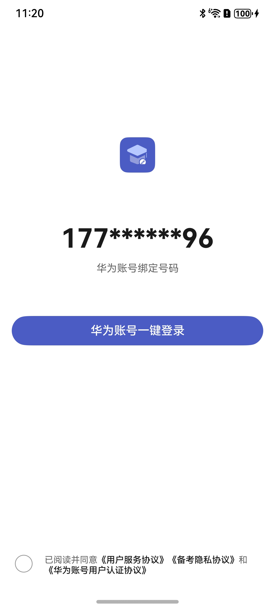

# 登录组件快速入门

## 目录

- [简介](#简介)
- [约束与限制](#约束与限制)
- [添加配置](#添加配置)
- [快速入门](#快速入门)
- [API参考](#API参考)
- [示例代码](#示例代码)

## 简介

本组件提供了华为账号一键登录的能力，开发者可以根据业务需要快速实现应用登录。



## 约束与限制
### 环境
* DevEco Studio版本：DevEco Studio 5.0.0 Release及以上
* HarmonyOS SDK版本：HarmonyOS 5.0.0 Release SDK及以上
* 设备类型：华为手机（直板机）
* HarmonyOS版本：HarmonyOS 5.0.0 Release及以上

## 添加配置

1. 配置华为账号服务。

   a. 将应用的client ID配置到entry模块的module.json5文件，详细参考：[配置Client ID](https://developer.huawei.com/consumer/cn/doc/harmonyos-guides/account-client-id)。
   ```
   ...
   "requestPermissions": [],
   "metadata": [
      {
        "name": "client_id",
        "value": "*****"
        // 配置为获取的Client ID
      },
    ],
    "extensionAbilities": [],
   ...
   ```
   b. [配置签名和指纹](https://developer.huawei.com/consumer/cn/doc/harmonyos-guides/account-sign-fingerprints)。

   c. [申请scope权限](https://developer.huawei.com/consumer/cn/doc/harmonyos-guides/account-config-permissions) 。

## 快速入门

1. 安装组件。

   如果是在DevEvo Studio使用插件集成组件，则无需安装组件，请忽略此步骤。

   如果是从生态市场下载组件，请参考以下步骤安装组件。

   a. 解压下载的组件包，将包中所有文件夹拷贝至您工程根目录的XXX目录下。

   b. 在项目根目录build-profile.json5添加login_info模块。

      ```
   // 在项目根目录build-profile.json5填写login_info路径。其中XXX为组件存放的目录名。
     "modules": [
       {
         "name": "login_info",
         "srcPath": "./XXX/login_info",
       }
     ]
   ```
   c. 在entry目录下oh-package.json5中添加依赖。
   ```
   // XXX为组件存放的目录名称
   "dependencies": {
      "login_info": "file:./XXX/login_info"
     }
   ```

2. 引入登录组件句柄。
   ```
   import { QuickLogin } from 'login_info';
   ```

3. 调用组件，详细参数配置说明参见[API参考](#API参考)

   ```
   import { QuickLogin } from 'login_info';
   import { promptAction } from '@kit.ArkUI';
   
   @Entry
   @Component
   struct Index {
     build() {
       Column() {
         QuickLogin({
           isBindContentCover: true,
           icon: $r("app.media.startIcon"),  //todo 需要图片资源
           loginBtnBgColor: "#4B5CC4",
           appName: "xxx",
           // 登录回调方法
           onLoginWithHuaweiID: () => {
             promptAction.showToast({ message: '登陆成功', duration: 2000 });
           },
           // 隐私协议方法
           onPrivacyPolicy: () => {
             promptAction.showToast({ message: '隐私协议点击事件', duration: 2000 });
           },
           // 服务协议方法
           onServicePolicy: () => {
             promptAction.showToast({ message: '服务协议点击事件', duration: 2000 });
           },
           // 华为账号用户认证协议
           onHYAccountRouter: () => {
             promptAction.showToast({ message: '华为账号用户认证协议点击事件', duration: 2000 });
           },
         })
       }
       .width('100%')
       .height('100%')
     }
   }
   ```

## API参考

### 接口

QuickLogin({icon:ResourceStr,loginBtnBgColor:ResourceStr,appName:string,isBindContentCover: boolean})

登录组件。

**参数：**

| 参数名                | 类型                                                                                                           | 必填 | 说明                                                                                                                              |
|:-------------------|:-------------------------------------------------------------------------------------------------------------|:---|:--------------------------------------------------------------------------------------------------------------------------------|
| icon               | [ResourceStr](https://developer.huawei.com/consumer/cn/doc/harmonyos-references/ts-types#resourcestr)                                                                                              | 是  | 应用图标，参考[UX设计规范](https://developer.huawei.com/consumer/cn/doc/harmonyos-guides/account-phone-unionid-login#section2558741102912) | | 是  | 登录渠道信息                                                                                                                          |
| loginBtnBgColor    | ResourceStr                                                                                                  | 是  | 一键登录按钮背景色                                                                                                                       | | 否  | 应用路由栈                                                                                                                           |
| appName            | string                                                                                                       | 是  | 应用隐私协议名称                                                                                                                        | | 否  | 应用路由栈                                                                                                                           |
| isBindContentCover | boolean                                                                                                      | 否  | 区分模态和半模态弹窗                                                                                                                      |

### 事件

支持以下事件：

#### onLoginWithHuaweiID

onLoginWithHuaweiID: () => void = () => {}

点击华为账号一键登录时的跳转方法。

#### onPrivacyPolicy

onPrivacyPolicy: () => void = () => {}

点击隐私协议时的跳转方法。

#### onServicePolicy

onServicePolicy: () => void = () => {}

点击服务协议时的跳转方法。

#### onHYAccountRouter

onHYAccountRouter: () => void = () => {}

点击华为用户认证协议时的跳转方法。

## 示例代码

   ```
   import { QuickLogin } from 'login_info';
   import { promptAction } from '@kit.ArkUI';
   
   @Entry
   @Component
   struct Index {
     build() {
       Column() {
         QuickLogin({
           isBindContentCover: true,
           icon: $r("app.media.startIcon"),  //todo 需要图片资源
           loginBtnBgColor: "#4B5CC4",
           appName: "xxx",
           // 登录回调方法
           onLoginWithHuaweiID: () => {
             promptAction.showToast({ message: '登陆成功', duration: 2000 });
           },
           // 隐私协议方法
           onPrivacyPolicy: () => {
             promptAction.showToast({ message: '隐私协议点击事件', duration: 2000 });
           },
           // 服务协议方法
           onServicePolicy: () => {
             promptAction.showToast({ message: '服务协议点击事件', duration: 2000 });
           },
           // 华为账号用户认证协议
           onHYAccountRouter: () => {
             promptAction.showToast({ message: '华为账号用户认证协议点击事件', duration: 2000 });
           },
         })
       }
       .width('100%')
       .height('100%')
     }
   }
   ```
